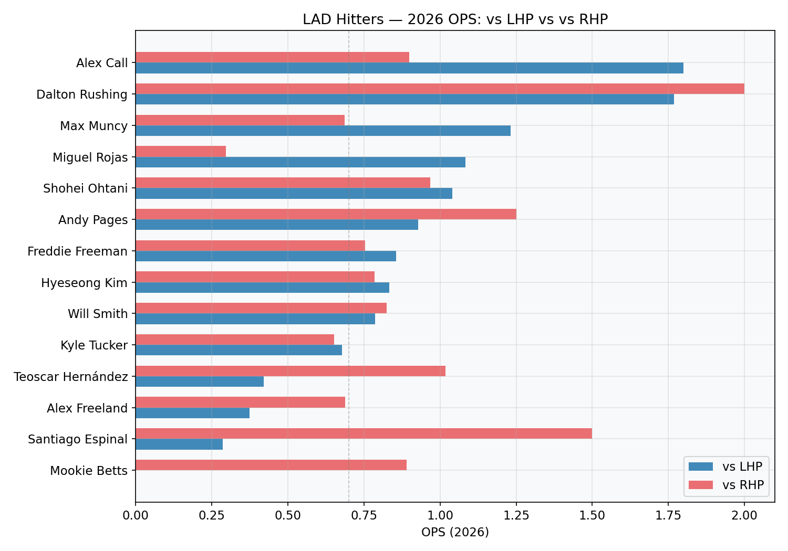
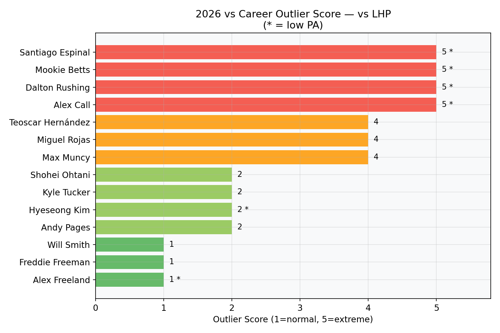
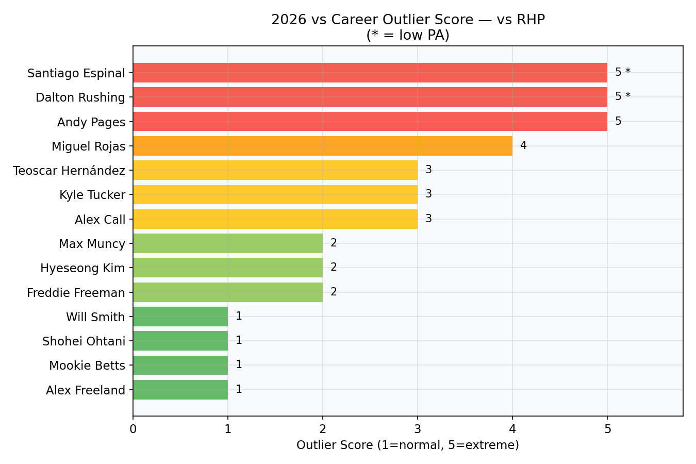
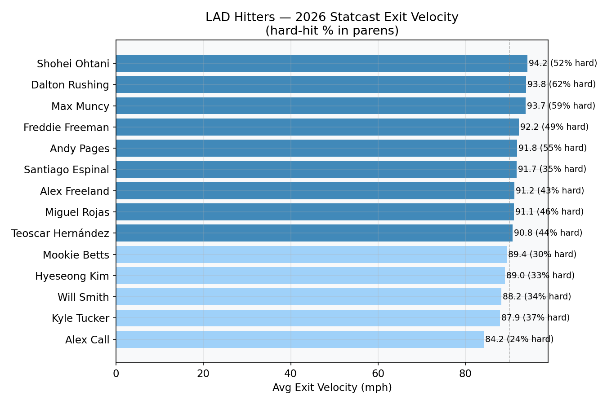
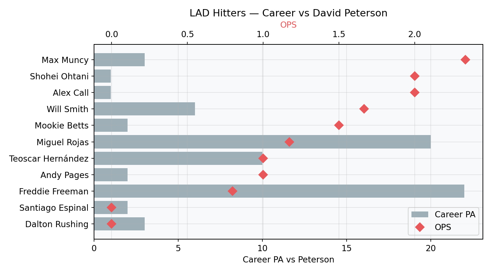

# LAD Hitters vs Left-Handed Pitching — Sprint Brief

**Prepared:** 2026-04-13 | **Deadline:** 15:00 America/Denver  
**Scope:** 14 Dodgers hitters — 2026 + career platoon splits, vs David Peterson, Statcast contact quality, outlier scoring  
**Data source:** MLB Stats API (live, `gameType=R`), Statcast via pybaseball  
**Golden check:** 14/14 players match BR reference exactly (G, AB, H, 2B, 3B, HR, RBI, BB, SO, BA, OBP, SLG, OPS).

---

## Executive summary

This brief profiles the 14 active Dodgers hitters against left-handed pitching in the 2026 season, compares their performance to career norms, and evaluates matchup history against David Peterson (LHP, NYM). Key findings:

- **Muncy** leads with a 1.231 OPS vs LHP (2 HR in 13 AB) — running hot above his .790 career mark. **Ohtani** (1.041) and **Freeman** (.856) provide the deepest career baselines.
- **Rushing, Call** post extreme 2026 OPS vs LHP but on tiny samples (8 and 5 PA) — high variance, not bankable.
- **Betts** is hitless in 6 PA vs LHP this year (0.000 OPS) — a confirmed slow start vs an .895 career mark.
- **Pages** stands out vs RHP (1.251 OPS, 46 PA) with strong Statcast quality — monitor for LHP-side improvement.
- Against **Peterson specifically**, Freeman (22 PA), Betts (14 PA), and Hernandez (10 PA) have the most data; Rojas and Smith own the best results.

---

## 1. 2026 vs LHP — current slash lines

| Player | PA | BA | OBP | SLG | OPS |
| ------ | --: | ---: | ---: | ---: | ---: |
| Alex Call | 5 | .667 | .800 | 1.000 | 1.800 |
| Dalton Rushing | 8 | .571 | .625 | 1.143 | 1.768 |
| Miguel Rojas | 13 | .455 | .538 | .545 | 1.083 |
| Shohei Ohtani | 23 | .300 | .391 | .650 | 1.041 |
| Max Muncy | 13 | .385 | .385 | .846 | 1.231 |
| Andy Pages | 14 | .333 | .429 | .500 | .929 |
| Freddie Freeman | 18 | .267 | .389 | .467 | .856 |
| Hyeseong Kim | 4 | .333 | .500 | .333 | .833 |
| Will Smith | 10 | .286 | .500 | .286 | .786 |
| Kyle Tucker | 18 | .200 | .278 | .400 | .678 |
| Teoscar Hernandez | 15 | .154 | .267 | .154 | .421 |
| Alex Freeland | 8 | .125 | .125 | .250 | .375 |
| Santiago Espinal | 7 | .143 | .143 | .143 | .286 |
| Mookie Betts | 6 | .000 | .000 | .000 | .000 |

### vs LHP and vs RHP comparison



---

## 2. Outlier scores — 2026 vs own career (same split)

The outlier score (1–5) measures how far each player's 2026 OPS in a given split deviates from their own career average in that same split. A score of **1** means roughly in line; **5** means extreme departure.

**LOW-N** flag: fewer than 10 PA in 2026 — treat with caution.

### vs LHP outliers

| Player | 2026 OPS | Career OPS | Score | Flag |
| ------ | -------: | ---------: | ----: | ---- |
| Alex Call | 1.800 | .760 | 5 | LOW-N |
| Dalton Rushing | 1.768 | .639 | 5 | LOW-N |
| Mookie Betts | .000 | .895 | 5 | LOW-N |
| Santiago Espinal | .286 | .748 | 5 | LOW-N |
| Miguel Rojas | 1.083 | .740 | 4 | |
| Teoscar Hernandez | .421 | .872 | 4 | |
| Max Muncy | 1.231 | .790 | 4 | |
| Freddie Freeman | .856 | .807 | 1 | |
| Will Smith | .786 | .819 | 1 | |



### vs RHP outliers (notable)

| Player | 2026 OPS | Career OPS | Score | Flag |
| ------ | -------: | ---------: | ----: | ---- |
| Andy Pages | 1.251 | .752 | 5 | |
| Dalton Rushing | 2.000 | .709 | 5 | LOW-N |
| Santiago Espinal | 1.500 | .617 | 5 | LOW-N |
| Miguel Rojas | .297 | .649 | 4 | |



---

## 3. Statcast contact quality — 2026 YTD

Exit velocity (EV) and hard-hit rate are the most stable early-season Statcast signals.

| Player | BBE | Avg EV | Max EV | Hard-Hit% | Barrel% |
| ------ | --: | -----: | -----: | --------: | ------: |
| Max Muncy | 34 | 93.7 | 112.7 | 58.8 | 20.6 |
| Shohei Ohtani | 46 | 94.2 | 117.1 | 52.2 | 28.3 |
| Dalton Rushing | 13 | 93.8 | 109.0 | 61.5 | 23.1 |
| Freddie Freeman | 63 | 92.2 | 110.3 | 49.2 | 15.9 |
| Andy Pages | 49 | 91.8 | 109.1 | 55.1 | 8.2 |
| Teoscar Hernandez | 39 | 90.8 | 110.7 | 43.6 | 15.4 |
| Kyle Tucker | 49 | 87.9 | 105.9 | 36.7 | 2.0 |



**Ohtani** leads in barrel rate (28.3%) and max EV (117.1). **Muncy** has a 20.6% barrel rate and 58.8% hard-hit rate — strong contact quality backing his hot start. **Tucker** is running a low 2.0% barrel rate — well below his career norms — which explains his suppressed slugging.

---

## 4. Career vs David Peterson (LHP, NYM)

| Player | PA | H | HR | BA | OPS |
| ------ | --: | -: | -: | ---: | ---: |
| Freddie Freeman | 22 | 5 | 2 | .238 | .797 |
| Mookie Betts | 14 | 5 | 0 | .385 | .967 |
| Teoscar Hernandez | 10 | 3 | 1 | .300 | 1.000 |
| Miguel Rojas | 9 | 5 | 1 | .556 | 1.667 |
| Will Smith | 6 | 3 | 1 | .500 | 1.667 |
| Dalton Rushing | 3 | 0 | 0 | .000 | .000 |
| Max Muncy | 3 | 2 | 1 | .667 | 2.334 |
| Santiago Espinal | 2 | 0 | 0 | .000 | .000 |
| Andy Pages | 2 | 1 | 0 | .500 | 1.000 |

*Tucker, Freeland, Kim: no career PA vs Peterson.*



**Rojas** (5-for-9, 1 HR) and **Smith** (3-for-6, 1 HR) own Peterson in small samples. **Betts** has the most reliable track record (14 PA, .385/.429/.538). **Freeman** has the most PA (22) but has been held to .238.

---

## 5. Key takeaways

1. **Platoon-advantaged starters vs a LHP like Peterson:** Muncy (1.231 OPS, backed by 20.6% barrel rate), Ohtani (1.041), and Freeman (.856 on the largest AB sample) lead.
2. **Hot early 2026 vs LHP but unreliable:** Call, Rushing — extreme OPS on under 10 PA.
3. **Cold start watch:** Betts (.000 vs LHP), Hernandez (.421), Espinal (.286) — all well below career norms. Tucker (.678) has a 2.0% barrel rate dragging him down.
4. **Statcast quality signal:** Ohtani (28.3% barrel, 117.1 max EV), Muncy (20.6% barrel, 58.8% hard-hit), and Rushing (23.1% barrel, small sample) are making the best contact.
5. **Peterson-specific:** Muncy (2-for-3, 1 HR), Rojas (7-for-18, 1 HR), and Smith (3-for-6, 1 HR) have historically hit Peterson; Freeman has the most PA (22) at .238.

---

## Data files

| File | Description |
| ---- | ----------- |
| `data/master/lad_hitters_sprint.parquet` | Full master table (98 rows) |
| `data/master/lad_hitters_sprint.csv` | Same, CSV format |
| `data/reports/analysis_vs_lhp_2026.csv` | 2026 + career vs LHP |
| `data/reports/analysis_vs_rhp_2026.csv` | 2026 + career vs RHP |
| `data/reports/analysis_peterson.csv` | Career vs Peterson |
| `data/reports/outlier_scores.csv` | Outlier scorecard (1–5) |
| `data/reports/statcast_contact_summary.csv` | Statcast contact quality |
| `data/raw/statcast_2026_ytd.parquet` | Raw Statcast pitch data (2,988 rows) |
| `docs/figures/*.png` | 5 chart PNGs |

---

## Limitations

- **Small samples:** Most 2026 splits have < 25 PA. Outlier scores are flagged but still volatile.
- **No model predictions:** This sprint uses descriptive statistics only. The long-term plan includes a calibrated PA-level model trained on 2015–2024 Statcast data.
- **API timing:** Data pulled live on 2026-04-13 via MLB Stats API (`gameType=R`, `sitCodes=vl,vr`). Golden validation: **14/14 exact match** against BR splits table.
- **Peterson PA:** 3 of 14 hitters have 0 career PA vs Peterson (Tucker, Freeland, Kim).
- **No FanGraphs advanced metrics** in this sprint (wRC+, xwOBA) — deferred to Phase 2.

---

## How to reproduce

```bash
cd "LAD vs LHP Analysis"
python3 -m venv .venv && source .venv/bin/activate
pip install -r requirements.txt
cd src
python ids.py
python fetch_splits.py
python fetch_master.py
python fetch_statcast.py
python outliers_and_charts.py
```

---

*Long-term plan (Phase 2) covers full 2015–2024 model training, league-wide Statcast, ensemble calibration, SHAP analysis, and Quarto executive PDF.*
